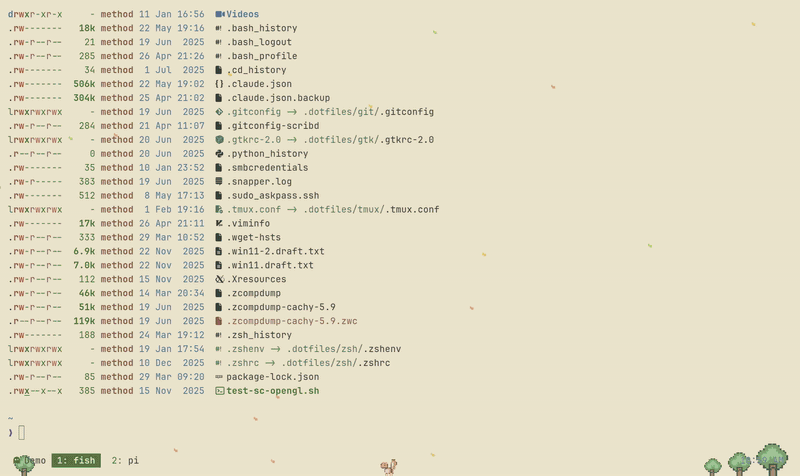

# vstack extras

Optional non-agent packages distributed by [vstack](../README.md). Currently one pack — `vanillagreen-themes` — bundling a VS Code-family theme/icon extension with matched Ghostty palettes and ambient shaders.

## vanillagreen-themes



> some of the shaders/animations are better than others.. feel free to improve them and submit a PR!

25 color themes + 1 file/folder icon theme shipped as a single VS Code extension (`vanillagreen.vstack-themes`), with per-theme Ghostty palette + ambient shader pairs. One `vstack apply` call installs the editor extension, switches the active editor theme, swaps the live Ghostty palette, and swaps the Ghostty `custom-shader`.

### Themes

Light (5):

- Anthropic
- Catppuccin Latte
- Ghibli Serene Nature
- Kawaii Pixel
- Rosé Pine Dawn

Dark (20):

- Anthropic Dark, Anthropic Slate
- Aura Dark
- Bearded Theme Monokai Black
- Catppuccin Frappé, Catppuccin Macchiato, Catppuccin Mocha
- Citrus
- Dracula
- Flowers
- Iceberg
- Method Dark *(VS Code only — no Ghostty palette)*
- Pixel Corsair
- Retro City Console
- Rosé Pine, Rosé Pine Black, Rosé Pine Extra Black, Rosé Pine Moon
- Tokyo Night
- Warp

### Icon theme

`Rosé Pine Icons` — 326-icon Rose Pine-tinted set, available under *Preferences → Theme → File Icon Theme* in any editor that has the extension installed.

### Install + apply

```bash
# Add the vstack source (once).
vstack add vanillagreencom/vstack

# Apply a theme. Default scope is global/user (app themes are user-level config).
vstack apply vanillagreen-themes --theme ghibli-serene-nature --target ghostty,vscodium,cursor
vstack apply vanillagreen-themes --theme rose-pine            --target ghostty,vscodium

# Preview without writing anything.
vstack apply vanillagreen-themes --theme dracula --dry-run
```

Targets: `ghostty`, `vscode`, `vscodium`, `cursor`. Add `--target` to restrict; omit to apply to every detected target.

There is no "installed vs not" — only **active vs not**. `vstack apply <theme>` is idempotent: it (re)installs the extension VSIX and switches the active theme. Settings.json is backed up before every mutation.

### Attribution

The pack redistributes content from several MIT-licensed upstream projects (combined and themed for vanillagreen); full notices preserved in `vanillagreen-themes/vscode/LICENSE.txt`. Upstream sources include `catppuccin.catppuccin-vsc`, `dracula-theme/visual-studio-code`, `cocopon/vscode-iceberg-theme`, `avetis.tokyo-night`, `beardedbear.beardedtheme`, `mvllow.rose-pine`, and `ravenothere.rose-pine-symbols` (itself a fork of `miguelsolorio/vscode-symbols`).
