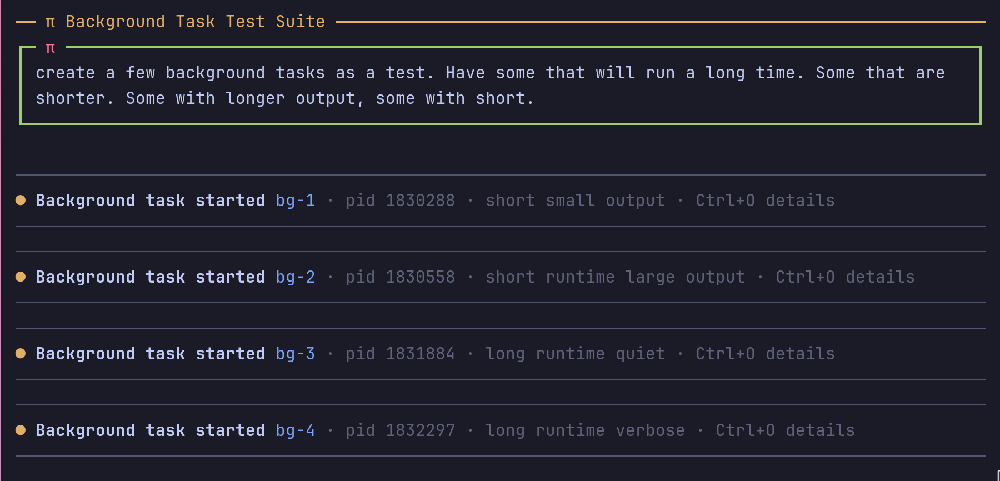
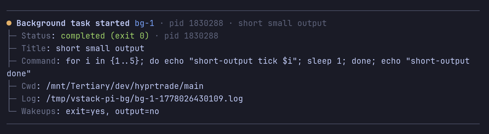
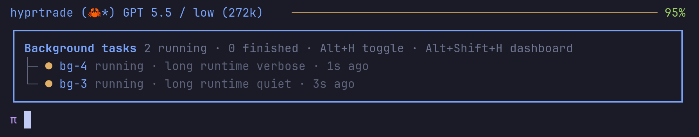
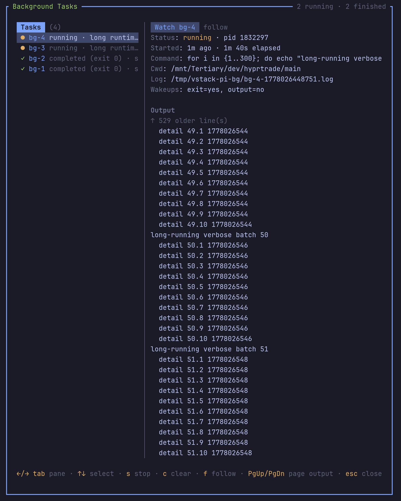

# pi-background-tasks





Pi package for explicit, non-blocking background shell tasks.

## What it provides

- `bg_task` tool for spawning, listing, tailing logs, stopping, and clearing tracked tasks.
- `bg_status` compatibility tool for list/log/stop by PID.
- `/bg` dashboard and task-control command.
- `Alt+.` arms a one-shot diversion so the next not-yet-started bash command runs as a background task instead of blocking the turn.
- `Alt+H` toggles the inline mini-dashboard compact/expanded; `Alt+Shift+H` opens the full dashboard.
- Automatic diversion of clearly long-running bash monitors such as `watch`, `tail -f`, `journalctl -f`, and session/tmux polling loops.
- Persistent log files under `${PI_BG_TASK_DIR:-$TMPDIR/vstack-pi-bg}`; truncated log output includes the full log path.
- Wakeups when a task exits, and optional wakeups when output matches a substring or `/regex/flags` pattern.

## Commands

| Command | Action |
| --- | --- |
| `/bg` | Open the dashboard. |
| `/bg next` | Arm the same one-shot diversion as `Alt+.` for the next bash command. |
| `/bg run <command>` | Spawn a background shell task. |
| `/bg list` | Show tracked tasks. |
| `/bg log <id\|pid>` | Show a task log tail. |
| `/bg watch <id\|pid>` | Open the dashboard focused on a task. |
| `/bg stop <id\|pid>` | Terminate a running task. |
| `/bg clear` | Remove finished tasks. |

Arguments support autocomplete, including task IDs for `log`, `watch`, and `stop`.

## Bash auto-backgrounding

The extension intercepts bash commands before they start. When a command is clearly a monitor or polling loop, it is spawned through the same background-task manager and the foreground bash tool is replaced with a short acknowledgement that includes the background task id, PID, and log path. This keeps the agent turn moving while the command continues to run.

Built-in auto-background matches are intentionally conservative:

- `watch ...`
- `tail -f ...` and `journalctl -f ...`
- delayed Pi session/tmux monitors such as `sleep 50; pi-bridge history ...`
- shell loops with `sleep` that appear to monitor Pi session bridge, tmux panes, subagent/delegate state, or long finite/open-ended polling loops

Use `Alt+.` or `/bg next` when you know the next bash command should be backgrounded even if it does not match the conservative patterns. The shortcut cannot detach a bash process that has already started, because Pi's built-in bash tool does not expose a public process handle to extensions. If pressed while a tool is already running, it applies to the next bash command that has not yet started.

Settings:

- `autoBackgroundBash` toggles built-in automatic diversion.
- `autoBackgroundPatterns` adds newline-separated regular expressions for project-specific monitor commands.
- `backgroundBashShortcut` changes the default `Alt+.` binding, or set it to `none` to disable.
- `forcedBackgroundNotifyOnOutput` optionally wakes the agent on output from shortcut-forced background tasks. Exit wakeups are always enabled for forced tasks.
- `forcedBackgroundWindowSeconds` controls how long `Alt+.`/`/bg next` stays armed.

## Tool usage

```json
{"action":"spawn","command":"sleep 20; echo done","notifyOnExit":true}
```

Useful `spawn` options:

- `notifyOnExit`: defaults to `true`.
- `notifyOnOutput`: defaults to `false`.
- `notifyPattern`: substring or `/regex/flags` gate for output wakeups.
- `timeoutSeconds`: defaults to `0` (no timeout).
- `title`: optional display label.

## Notes

Tasks are scoped to the current Pi runtime and are stopped on session shutdown. On Unix, shells start in their own process group so `/bg stop` and shutdown terminate child processes as well as the shell. For Pi bridge, session monitoring, and tmux/subagent pane monitoring, prefer `bg_task`, `/bg run`, or the built-in auto-backgrounding over raw foreground polling loops.

## Attribution

This package is locally owned by vstack and is based on ideas and portions of the MIT-licensed `@ifi/pi-background-tasks` package from `ifiokjr/oh-pi`. See `THIRD_PARTY_NOTICES.md`.
