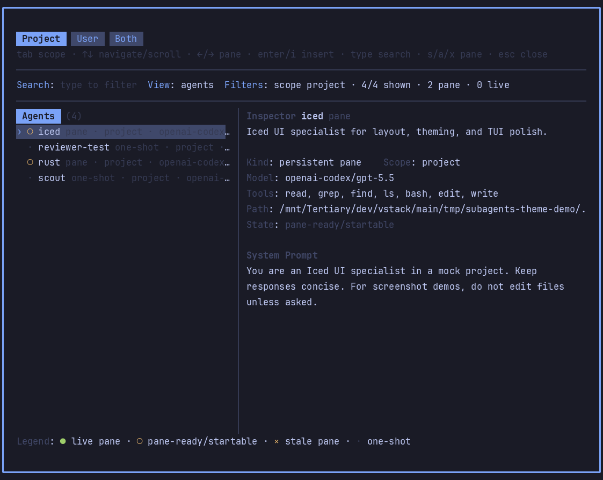
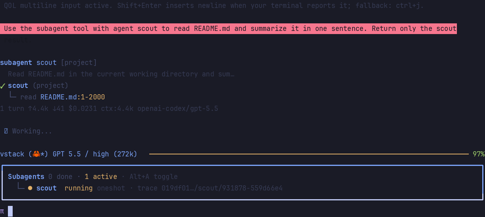
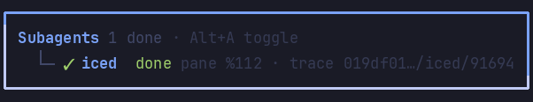
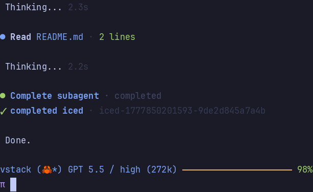

# pi-subagents-tmux









Pi package for delegating work to specialized agents from a running Pi session.

## What it provides

- `subagent` tool for one-off delegation, parallel delegation, or sequential chains.
- Project/user agent discovery from `.pi/agents`, `.claude/agents`, and `~/.pi/agent/agents`.
- Persistent tmux panes for agents with `pane: true` frontmatter.
- Grouped, themed completion notifications for persistent pane results.
- Durable task registry plus `get_subagent_result` recovery by `taskId` or latest agent task.
- `steer_subagent` for bridge-based mid-run steering, limited to exact child session-file targeting, with an explicit inbox fallback when that exact bridge target is unavailable.
- Session-scoped inbox/outbox handoff, transcript artifacts, and pane registries under `~/.pi/agent/vstack/pi-subagents-tmux/sessions/<session-id>/`.
- Grid-style tmux layout and pane titles like `subagent:iced`.

## Tool modes

Single task:

```json
{ "agent": "rust", "task": "Inspect error handling and summarize findings." }
```

Parallel tasks:

```json
{
  "tasks": [
    { "agent": "iced", "task": "Review the widget layout." },
    { "agent": "reviewer-test", "task": "Check test coverage gaps." }
  ]
}
```

Sequential chain:

```json
{
  "chain": [
    { "agent": "scout", "task": "Map the relevant files." },
    { "agent": "planner", "task": "Turn this into a plan: {previous}" }
  ]
}
```

Useful options:

- `agentScope`: `project` (default), `user`, or `both`.
- `cwd`: override working directory for a single task.
- `confirmProjectAgents`: prompt before using project-local agents.

Persistent pane delegations return a `taskId`. Keep it if you need to retrieve or steer the task later.

## Commands

| Command | Action |
| --- | --- |
| `/agents` | Open the browser using project scope. |
| `/agents project\|user\|both` | Open the browser with an explicit scope. |
| `/agents show <name> [scope]` | Inspect an agent. |
| `/agents start <name>` | Start or reuse a persistent pane. |
| `/agents send <name> <task>` | Queue a task for a persistent pane. |
| `/agents attach <name>` | Focus an existing pane. |
| `/agents stop <name>` | Stop a persistent pane. |
| `/agents status` | Show pane status. |
| `/agents collect` | Collect completed pane results. |
| `/agents transcripts` | Open/list recent subagent transcripts. |
| `/agents trace <ref>` | Open/show one trace by task id, short id, or trace ref. |
| `/agents toggle` | Toggle the persistent dashboard. |

Arguments support autocomplete, including known agent names for `show`, `start`, `send`, `attach`, and `stop`.

## Browser keys

- Type to search by name, description, source, path, model, tools, or pane status.
- `Tab` / `Shift+Tab` switches scope tabs: project, user, both.
- `↑/↓`, `PageUp/PageDown`, `Home/End` navigate the list; `←/→` switches focus between list and inspector.
- In the inspector, `↑/↓`, `PageUp/PageDown`, `Home/End` scroll the system prompt preview.
- `Enter` inserts `Use subagent <name> to: ` into the editor.
- For `pane: true` agents, `Ctrl+P` starts/reuses a pane, `Ctrl+O` attaches, and `Ctrl+X` stops it.
- `Esc` clears search or closes.

Status legend: `●` live pane, `○` pane-ready/startable, `×` stale pane, `·` one-shot.

Non-interactive mode emits inline list/show output. Management commands remain available.

## Persistent pane agents

Agents with `pane: true` frontmatter use a persistent tmux pane instead of one-shot JSON mode:

```yaml
---
name: iced
description: Iced UI specialist
tools: read, grep, find, ls, bash, edit, write
model: openai/gpt-5.5:xhigh
pane: true
---
```

The parent Pi session writes tasks to `inbox/<agent>/` and polls `outbox/<agent>/` under the session runtime directory. Sessions, prompt copies, launcher scripts, inbox/outbox, processed files, and pane registries are isolated by Pi session ID and never stored under the project's `.pi/` directory. Completions are surfaced back into the main conversation automatically.

Persistent panes require running Pi inside tmux. Completion files are collected in polling batches and shown as one grouped notification when multiple agents finish together. The notification includes summary, files changed, validation, source/archive paths, and the pane session transcript path.

## Result retrieval and steering

```json
{ "taskId": "iced-...", "wait": true }
```

Use `get_subagent_result` with either `taskId` or `agent` (latest task for that agent). It reads the durable `tasks.json` registry and can poll pending outbox files until a task reaches `completed`, `blocked`, or `failed`. This is a recovery/status reader for persistent pane tasks; it does not create panes, steer agents, or change Flightdeck/Orchestration ownership rules.

```json
{ "taskId": "iced-...", "message": "Prioritize the failing layout test.", "deliverAs": "steer" }
```

Use `steer_subagent` for mid-run correction. It targets `pi-session-bridge` (`steer`, `send --auto`, or `follow-up`) only when `pi-bridge list --json` contains an exact match for the child pane's registered `sessionFile` under this parent session runtime. It never falls back to matching by cwd, because multiple tmux tabs/sessions may share the same project path. If the exact bridge target is unavailable, it prints diagnostics and queues a clear steering note in the pane inbox; that fallback is not true mid-run steering and runs when the pane is idle.

## Artifacts and events

- One-shot JSON-mode subagents write JSONL transcripts under `transcripts/<agent>/`.
- Persistent panes expose the full visible Pi session JSONL as their transcript path.
- Oversized one-shot final output can still be preserved under `outputs/<agent>/`.
- The extension emits best-effort in-process lifecycle events: `subagents:ready`, `subagents:created`, `subagents:queued`, `subagents:started`, `subagents:completed`, `subagents:failed`, and `subagents:steered`.

## In-process one-shot sessions (not implemented)

A future backend could use Pi SDK `createAgentSession()` for non-pane one-shot subagents to reduce process overhead, get direct session events, improve cancellation, and simplify transcript collection. Persistent `pane: true` agents should remain external visible Pi processes because they are intentionally tmux-observable, long-lived, steerable through the session bridge, and inspectable outside the parent turn.

## Settings

`pi-extension-manager` exposes:

- `maxParallelTasks` and `maxConcurrency` for one-shot delegation limits.
- Dashboard controls: `dashboard`, `quietInlineWhenDashboard`, `dashboardMaxItems`, `dashboardCollapsed`, `dashboardShortcut` (default `alt+a` cycles dashboard mode), `popupShortcut` (default `alt+shift+a` opens the full `/agents` browser), and `treeStyle`.
- `collapsedItemCount` for compact result rendering.
- `truncateResults`, `resultMaxBytes` (default 102400), `resultMaxLines` (default 4000), and `preserveFullOutput` for result truncation. Oversized one-shot outputs are saved under `~/.pi/agent/vstack/pi-subagents-tmux/sessions/<session-id>/outputs/` when preservation is enabled.
- `completionPollMs` and `childInboxPollMs` for persistent pane polling intervals.
- `forceSessionBridgeForPanes` (default `true`) explicitly loads `pi-session-bridge` in new pane launchers so steering continues to work if settings drift.
