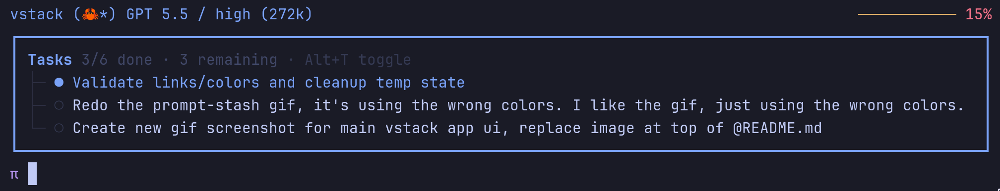
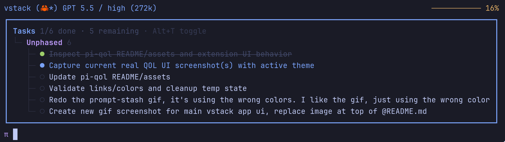
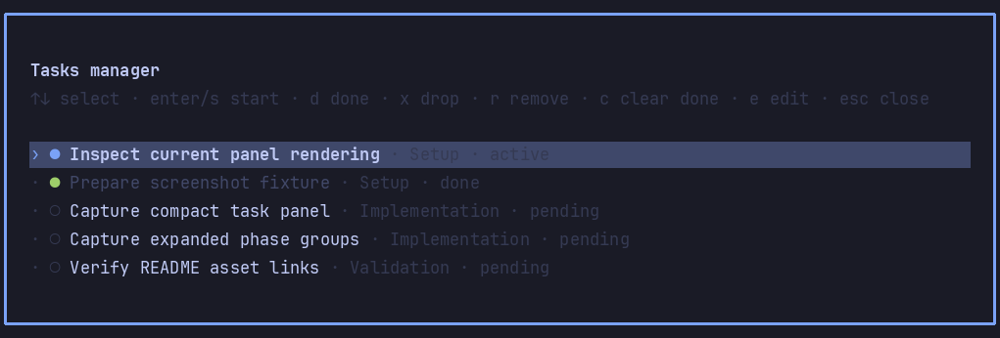

# pi-task-panel

Persistent structured task panel above the Pi status line/editor.

## Commands

| Command | Action |
| --- | --- |
| `/tasks` or `/tasks manage` | Open the interactive manager. |
| `/tasks add <task>` | Add one task; use `Phase :: task` to assign a phase. |
| `/tasks edit` | Bulk-edit tasks as plain text. |
| `/tasks start <task>` | Set a task active. |
| `/tasks done <task>` | Mark a task completed. |
| `/tasks drop <task>` | Mark a task abandoned. |
| `/tasks remove <task>` | Remove a task. |
| `/tasks hide` | Hide the panel. |
| `/tasks show` | Show the compact panel. |
| `/tasks show-all` | Show the expanded panel. |
| `/tasks clear-completed` | Remove completed tasks. |
| `/tasks export <path>` | Write tasks to a markdown file. |
| `/tasks import <path>` | Load tasks from a markdown file. |

Arguments support autocomplete, including task names for focused actions.

## Manager keys

Select with `↑/↓`. `Enter`/`s` starts, `d` marks done, `x` drops/abandons, `r` removes, `c` clears completed tasks, and `e` opens bulk edit.

`/tasks edit` uses plain text (`- task name`) with optional status suffixes: `(active)`, `(done)`, or `(dropped)`.

## Agent tool

The model updates tasks with `tasks_write`. Tool results render as compact inline status rows by default; set `compactToolOutput=false` to use Pi's normal padded tool box.

Panel behavior:

- Keeps one active task highlighted.
- Automatically advances to the next pending task when the active task is completed/dropped.
- Hides when all tasks are complete and reappears when pending work is added.
- Groups tasks by `phase` in expanded mode.
- `tasks_write` runs sequentially so multiple transitions in one assistant response cannot race.
- When tasks remain, `showWorkflowReminder` adds hidden task context plus a model-facing reconciliation reminder.

State stores snapshots in `tasks_write` result details, with project/session custom entries as an extra restore path.

## Shortcut

Pi uses `Ctrl+T` for thinking visibility. This package always registers the alternate shortcut from settings (`Alt+T` by default), which cycles `hidden → show 4 → show all`. It registers `Ctrl+T` only when `takeoverCtrlT` is enabled in the extension manager and Pi is reloaded.
